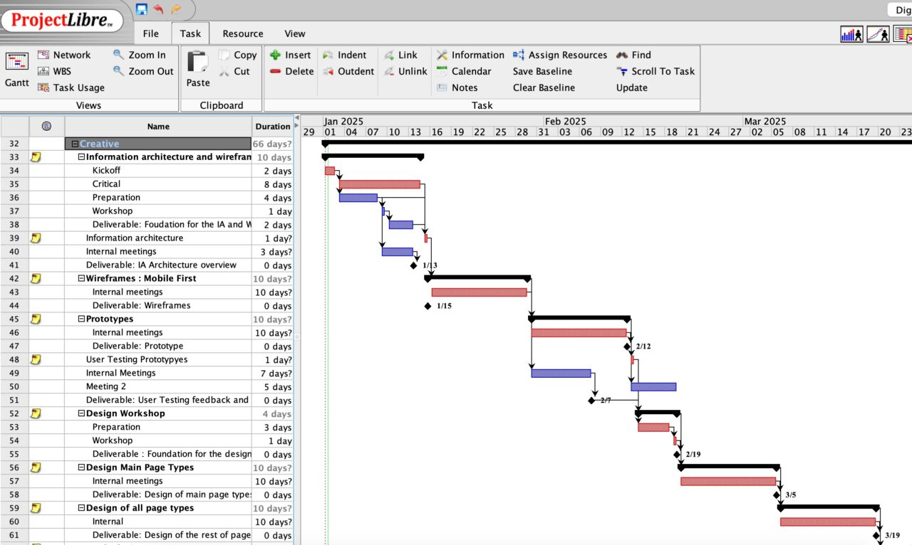
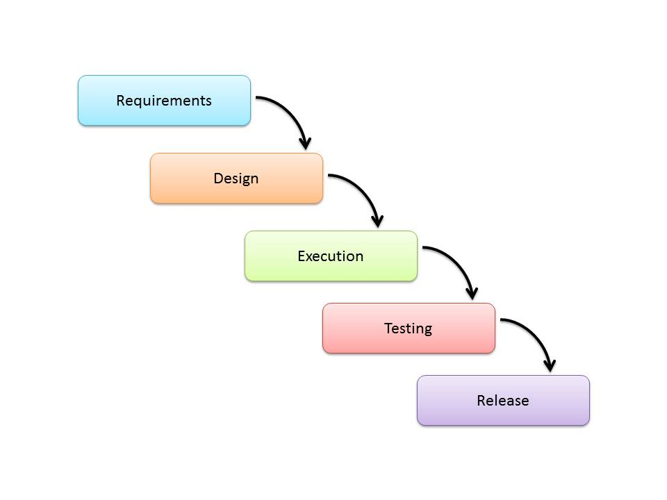
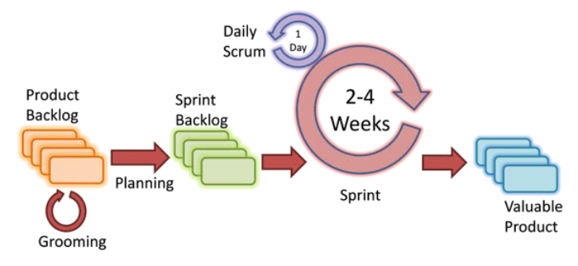

[session1](../../session1/) | [Project Management](../docs/projectManagement1.md)

# Introduction to Project Management

Many software development projects have failed due to poor management. 

In his book, "The Mythical Man Month", Fred Brooks describes how IBM tried to prevent a project delivering late by adding many extra people. 
Unfortunately the overhead of bringing these people up to speed caused even more delays.
The conclusion was that managing a complex software development project requires numerous techniques for a successful outcome. 

.jpg")

[The Mythical Man Month overview](https://en.wikipedia.org/wiki/The_Mythical_Man-Month)

In this section we will look at some common project management techniques and tools. 

## Project Management & Gantt Charts

Gantt Charts are commonly used to show the relationship between activities in a project.

Please note that Microsoft Project is not longer available on line but may be available for students to download.
However a good alternative which provides equivalent functionality is [ProjectLibre](https://sourceforge.net/projects/projectlibre/)
   
Example Gantt Chart:

## Waterfall development life cycle

The waterfall Model is a linear sequential flow. 
In which progress is seen as flowing steadily downwards (like a waterfall) through the phases of software implementation. 
This means that any phase in the development process begins only if the previous phase is complete. 
The waterfall approach does not define the process to go back to the previous phase to handle changes in requirement. 
The waterfall approach is the earliest approach that was used for software development.

Projects which not focus on changing the requirements, for example, projects initiated from request for proposals 
[Request For Proposals RFP](https://en.wikipedia.org/wiki/Request_for_proposal)

| Advantages                              | Disadvantages                     |
|:----------------------------------------|-----------------------------------|
| - Easy to explain to the users.         |  - Assumes that the requirements of a system can be frozen.       |
| - Structures approach.        |  - Very difficult to go back to any stage after it finished.        |  
| - Stages and activities are well defined. | - A little flexibility and adjusting scope is difficult and expensive.        |   
| - Helps to plan and schedule the project. |  - Costly and required more time, in addition to the detailed plan.        | 
| - Verification at each stage ensures early detection of errors or misunderstanding.        | 

## Agile development life cycle 

Agile is based on iterative and incremental development, where requirements and solutions evolve through collaboration between cross-functional teams.

It can be used with any type of the project, but it needs more involvement from the customer and to be interactive. 
Also, it can be used when the customer needs to have some functional requirement ready in less than three weeks.

| Advantages                              | Disadvantages                     |
|:----------------------------------------|-----------------------------------|
|-  Decrease the time required to availability of some system features.|-  Scalability. |
|-  Face to face communication and continuous inputs from customer representative leaves no space for guesswork. |-  The ability of the customer to express user needs. |
|-  The end result is the high-quality software in the least possible time duration and satisfied customer. |-  Documentation is done at later stages.|
|                                         |-  Reduce the re-usability of components.|
|                                         |-  Needs special skills for the team.|

## Kanban schedule board

Kanban was first developed by Toyota as a better way of allocating resources in a factory.
The principles of Kanban were picked up by the software development community to help organise development teams around custoemr requirements.

See [Kanban_(development)](https://en.wikipedia.org/wiki/Kanban_(development))

Your project on github is based on the Kanban system.

