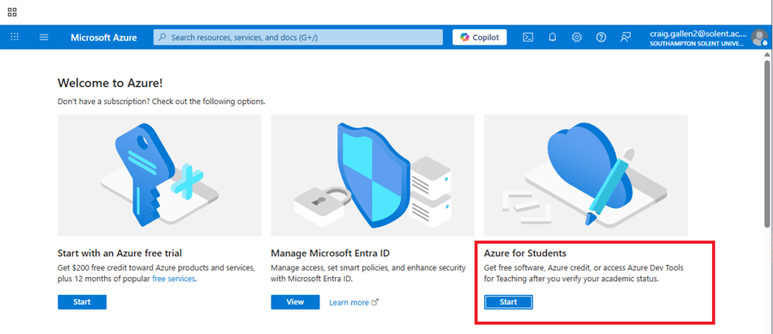
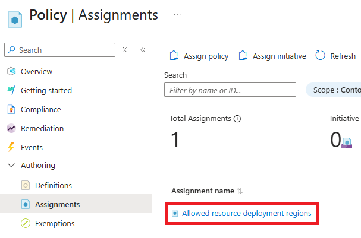
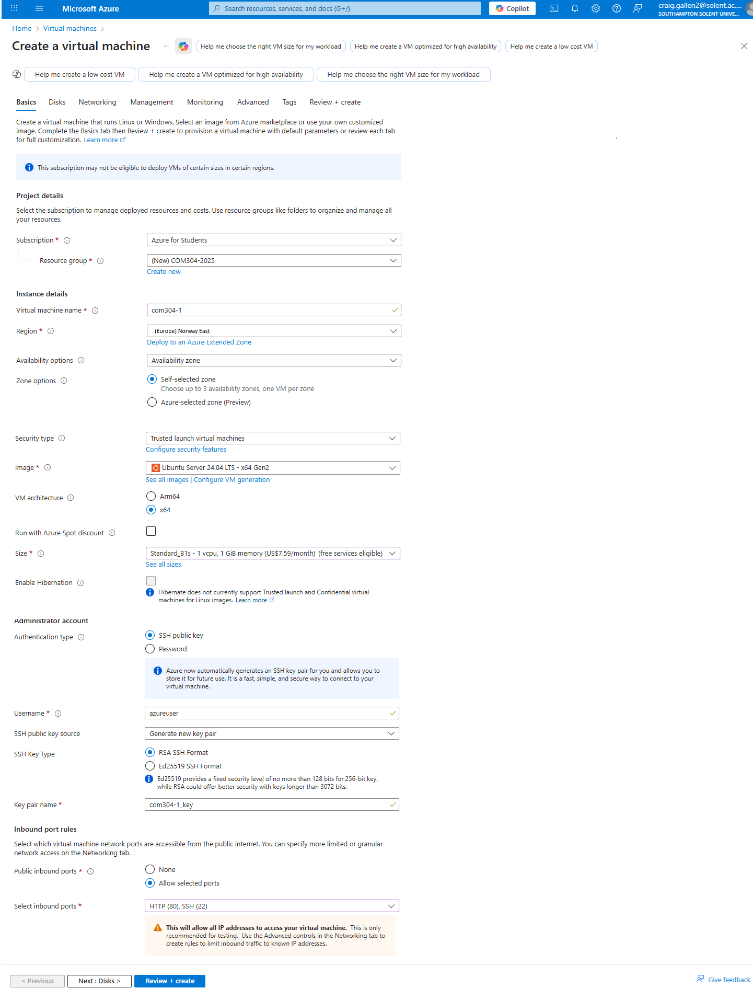
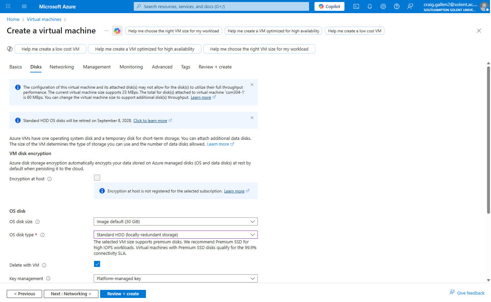
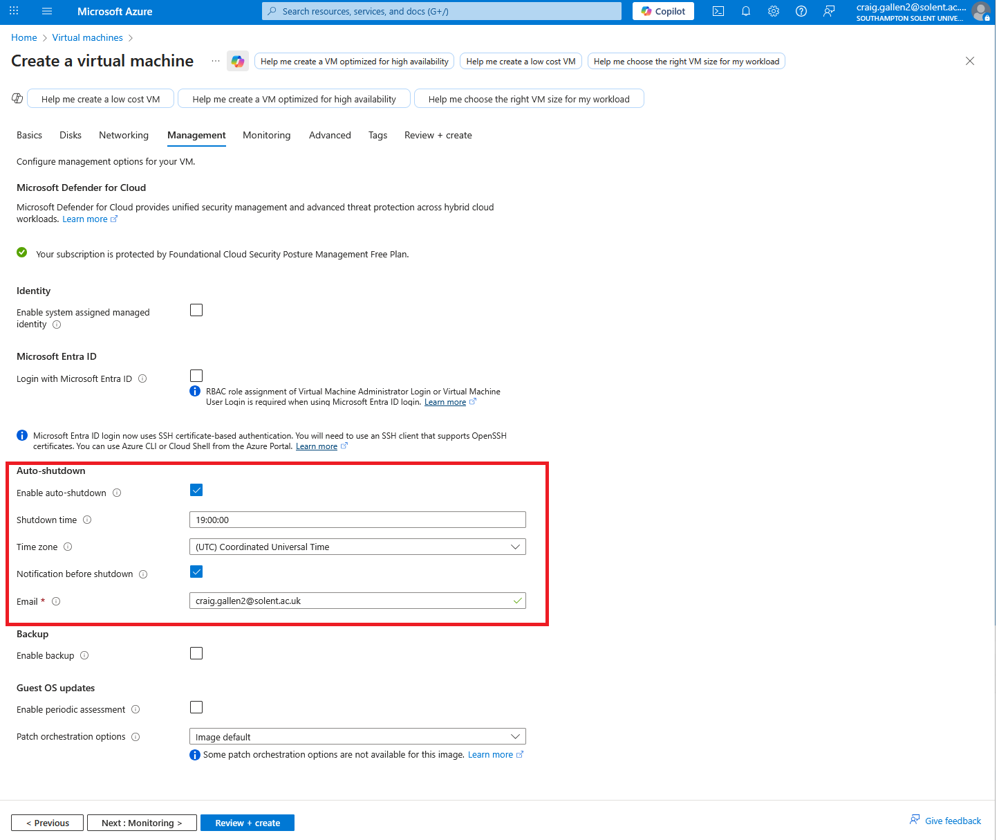
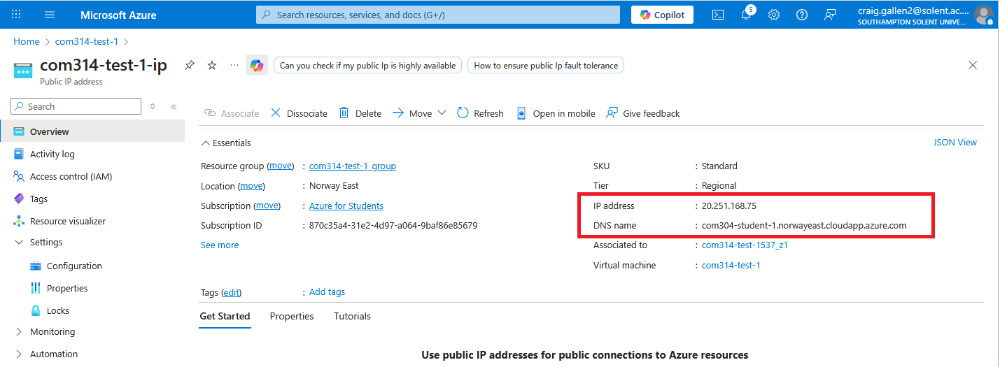
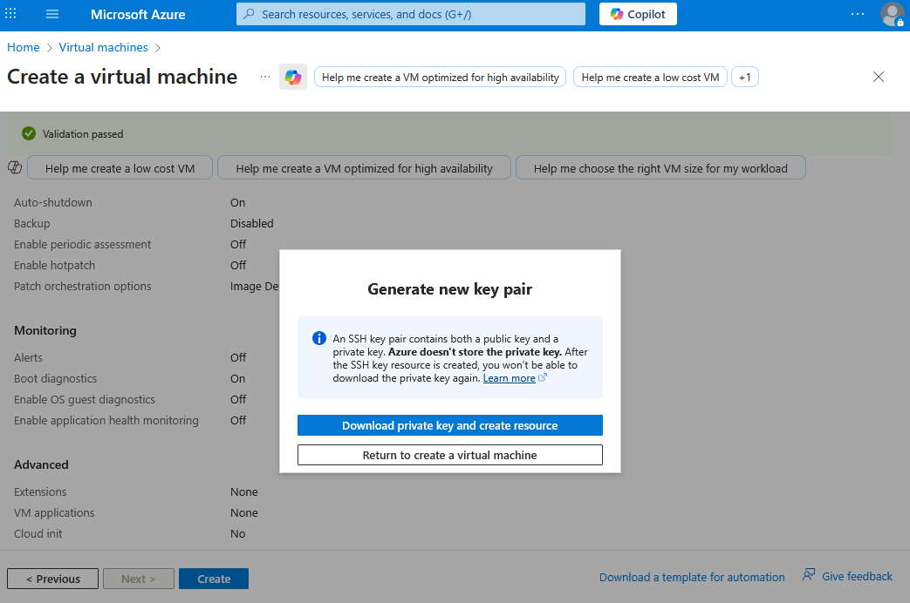
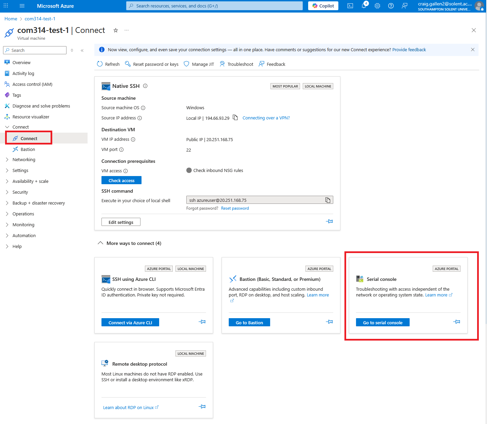
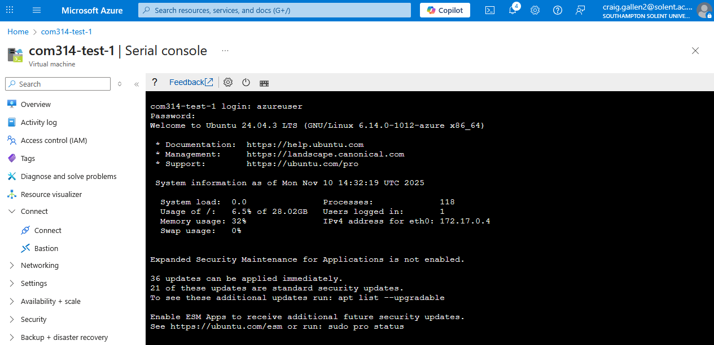
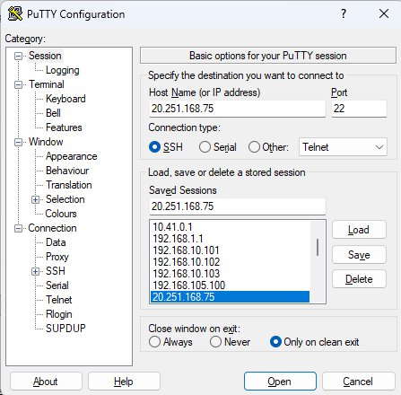

[session1](../../session10/) | [Cloud Computing Azure ](../docs/AzureExercises1.md)

# Cloud Computing With Azure

One of the most fundamental aspect of cloud computing is the ability to create run and delete virtual machines on demand.
A virtual machine simulates the cpu, memory and disks of a computer and can run an operating system just like a physical machine.
In reality it is being hosted on top of physical computers in a data centre run by a cloud provider. 

See the video [Microsoft reveals its MASSIVE data center (Full Tour)](https://www.youtube.com/watch?v=80aK2_iwMOs)

We will be creating a virtual machine in the Microsoft Azure cloud platform.

## Signing up for an Azure account

All students are eligible for a Microsoft Azure student account which allows up to $100 of resources usage a year and up to 750 hours of virtual machine run time. 

Sign up for a student account using your university email at [Azure Student Accounts](https://azure.microsoft.com/en-gb/free/students/)



(You should not need to provide a credit card).


## Creating a Virtual Machine

1. log in to your new Azure account

2. First you need to find which regions you can use to create a machine with your student account;
   
   [https://portal.azure.com/#view/Microsoft_Azure_Policy/PolicyMenuBlade/%7E/Assignments](
https://portal.azure.com/#view/Microsoft_Azure_Policy/PolicyMenuBlade/%7E/Assignments)
   
   Select `Assignments>Allowed resource deployment regions`
      
   
   
   You should see a list like `["italynorth","norwayeast","switzerlandnorth","germanywestcentral","swedencentral"]`

3. Back at the Azure main dashboard, select `Virtual Machines`

   

4. select `Create>Azure Virtual lMachine`

   
   
5. You will be presented with a configuration page for the new machine

   

6. Fill in the values similar to this example page.
   
   * create a new resource group `COM304-2025`
   * select a new virtual machine name `com314-test-1`
   * choose one of the regions from the list above. (Any other region and you will not be allowed to create the machine). I chose `Norway East` because it allows automatic shutdown of machines. 
   
7. Select a machine size from `sizes`
   Different sizes are available in each region.
   We want a very small machine so `B1s` is the beast choice 1 CPU, 1G RAM at $9.64 per month

8. Select Authentication Type - password (NOT SSH which is hte default))

   * Password : generate your own using [https://1password.com/password-generator](https://1password.com/password-generator)>
   * Username azureuser

9. Select inbound ports SSH(22) HTTP (80)

10. On the Disks Page Select a Hard Disk HDD (Not SSD)



11. On the Management page select auto shutdown (very important!)



12. Finally select `Review + Create`

You will see the overview of the machine with the public IP address and you can set a DNS name for the machine

   

13. Alterative Authentication with SSH (OPTIONAL)

Note if you select use SSH key for authentication, you will be asked to download the generated private key.
   
   This will be called something like com314-test-1_key.pem
   
   Note you will never be able to get this again - keep it safe.

   
   
   See the example [how to connect your server using ssh with pem key file](https://try.direct/blog/how-to-connect-your-server-using-ssh-with-pem-key-file)
   
## Accessing your machine

You can access the running machine from the azure web page using the serial console with your username and password

   
   
   
   
   

Or you can access the machine over the Internet using [Putty](https://www.chiark.greenend.org.uk/~sgtatham/putty/latest.html) and SSH. 

Use the IP address or the DNS name with Putty

   

## Install Apache

1. log into your virtual machine

2. use the following commands to install apache and turn it on.

```
sudo apt update
sudo apt install apache2
sudo systemctl start apache2

```

You can see the web page at http://your-vm-ip-address/

See if you can work out where apache is serving the web page from and see if you can add an additional page like in the Apache exercise with the Raspberry PI


