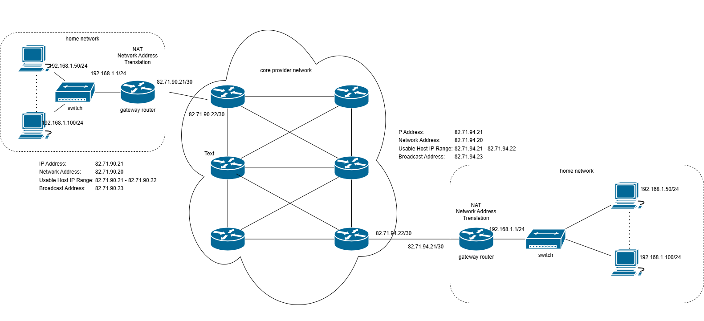

[Main Menu](../../README.md) | [session9](../../session9/) | [Introduction to Networking](../docs/introduction-to-networking.md)

# Introduction to Networking

In this section we will give a basic introduction to `networking`, that is, how computers and devices communicate with each other over the Internet.

Modern computer networks use the `Internet Protocol (IP)` to divide the data to be communicated into separate `datagrams` or `packets` which are like addressed envelops containing multiple bytes.
These packets are separately routed through the network and reassembled at their destination into their original format.

IP networks contain devices which can be characterised as `computers` or `routers`.

Computers in a network may variously also be referred to as `hosts` or `servers` or `workstations`. 
Computers can have several `ports` (also called `interfaces`).
For example most PCs have a `wifi` interface and a `wired` interface.
These are usually `end points` of a network since they only originate or consume network traffic but don't route traffic between `ports`.
(Computers can be set up to act as routers if they have multiple ports but this is usually the role of dedicated router hardware).

`Routers` are devices in a network which collaborate to `route` packets from their source across the network to their final destination.

Our simple introduction to IP networking will concentrate on what happens in a small office or home network at the edge of the Internet.
This will introduce the basic networking principles but will leave a full discussion of enterprise networking to a later networking course.

The diagram below illustrates how domestic `gateway routers` connect to a core `provider network` which carries communications to a far destination.

We will see that a network can be divided into multiple sub-networks and that routers are used to pass packets from their source device across several subnetworks to their final destination device.

Note that in this example, each edge router has a public IP address ending in `/30` while the private home network has a private ip address ending in `/24`.
This is called the `subnet mask` in `CIDR notation`.
We will look in more detail at this later but for now,
* See if you can calculate how many hosts can be in the `/30` edge network using the [subnet calculator](https://www.calculator.net/ip-subnet-calculator.html)
* See if you can calculate how many host addresses can be attached to the `/24` private home network side of the gateway routers. 

## Network protocol layers

Over the years there have been many networking technologies which have been standardised, widely adopted and later superseded by something better (e.g. Fibre, Frame Relay, ISDN, ATM, ADSL, Wifi, Dial up modems etc).
Engineers have found it useful to describe each of these technologies in terms of ascending `network layers` starting with the  physical medium (Wireless, Electrical cables, Light) and rising to the application using the network (Web Browser, file transfer, video, audio etc). 

A `network protocol` is a set of conventions governing the treatment and especially the formatting of data in an electronic communications system.
Each network layer has its own `protocol` and in a well designed system, it should be possible to substitute one protocol in a given layer for another protocol in the same layer without the layers above or below noticing the change or needing to be changed.
As an example, your computer could connect to a wired `ethernet` network or to a wireless `wifi` network and apart from a change of IP address, the applications using the network connection will all continue to work the same way.

The most comprehensive model used for describing networks is the [OSI 7 Layer Model](https://en.wikipedia.org/wiki/OSI_model) which is simplified in the following diagram.

The higher layers of the `protocol stack` are responsible for the end to end communication between applications running on different computers.

The lower layers are responsible for moving information around the network across multiple `subnetworks` connected by routers.

We will simplify the model to just 4 layers in the following diagram which also shows the data formats used in each layer.

References : 
[TCP (Wikipedia)](https://en.wikipedia.org/wiki/Transmission_Control_Protocol), 
[IPv4 (Wikipedia)](https://en.wikipedia.org/wiki/IPv4), 
[Ethernet (Wikipedia)](https://en.wikipedia.org/wiki/Ethernet_frame)

### The Application layer

The Application layer defines the data formats which are transferred between computers to make a specific application work.
Examples are

|           |                                                 |
|:----------|-------------------------------------------------|
|HTTP       | [Hyper Text Transport Protocol](https://en.wikipedia.org/wiki/HTTP). Is the protocol used to transfer web pages across the internet.|
|SSH        | [Secure Shell (SSH)](https://en.wikipedia.org/wiki/Secure_Shell). Is used for secure communications between computers  |
|FTP        | [File Transfer Protocol](https://en.wikipedia.org/wiki/File_Transfer_Protocol)  used to list remote directories and transfer files between computers |                                                 
|SMTP       | [Simple Mail Transfer Protocol](https://en.wikipedia.org/wiki/Simple_Mail_Transfer_Protocol) Used to send and receive e-mail messages | 

All of these example protocols use TCP as their transport layer.

### The Transport layer

The Transport Layer is responsible for defining the quality of the data connection between the original application and its intended destination.

Two protocols are widely chosen in this layer;

`User Datagram Protocol (UDP)` is a communications protocol for time-sensitive applications like gaming, playing videos, or Domain Name System (DNS) lookups. 
Each UDP packet is stand alone and is sent `fire and forget`.
In other words, there is no guarantee that UDP packets will arrive or that they will arrive in the same order as they were sent.

`Transmission Control Protocol (TCP)` provides a more reliable transport by numbering packets using a `sequence number` so that it can resend packets which have been lost and guarantee that packets will arrive in their sent order.
The overhead of establishing a TCP session and keeping track of lost packets makes TCP much slower then UDP and less suitable for real-time applications.

In addition to the IP Address, you will note that UDP and TCP packets in the transport layer define source and destination port numbers. 
Port numbers consist of 16-bit numbers.
A number of destination ports are reserved for well known applications.

| | |
|:---|:---|
|Ports 20 and 21| File Transfer Protocol (FTP) is used to transfer files between a client and a server.|
|Port 22| Secure Shell (SSH) used to build secure network connections.|
|Port 25| Simple Mail Transfer Protocol (SMTP) is commonly used for email.|
|Port 53| Domain name system (DNS) is a critical process that matches human-readable domain names to machine-readable IP addresses on the modern internet. |
|Port 80| HTTP is the protocol that enables the World Wide Web. http://localhost is automatically treated as http://localhost:80 unless told otherwise|
|Port 443|HTTP Secure (HTTPS) is like HTTP but more secure. All HTTPS web traffic goes straight to port 443. Note browsers connected to https automatically use port 443 unless told othersies i.e. https://localhost is treated as https://localhost:443 |

If a machine has only one IP address, it needs to randomly generate different source port numbers for each client request, so that the remote computer knows which port to send its repy to in order to reach the client on the computer which sent the request. 
The source port can also be used to enable `Network Address Translation (NAT)` which we will consider under the networking layer.

### Network Layer (OSI layer 3)

The `network layer` is used to communicate across a network consisting of multiple `link layer` segments.

Review [The Network Layer](../docs/network-layer.md) for more information.

# Practical Networking Exercises

Having reviewed the examples above, try the following networking exercises on your Raspberry Pi.

[Networking Exercises](../docs/networking-exercises.md)

### The Link Layer (OSI layer 2)

The link layer is used for local point to point communications where the communicating devices send signals directly between each other over a physical medium.

The network layer joins together separate link layer segments to form an end to end network.

Review [The Link Layer](../docs/link-layer.md) for more information.
